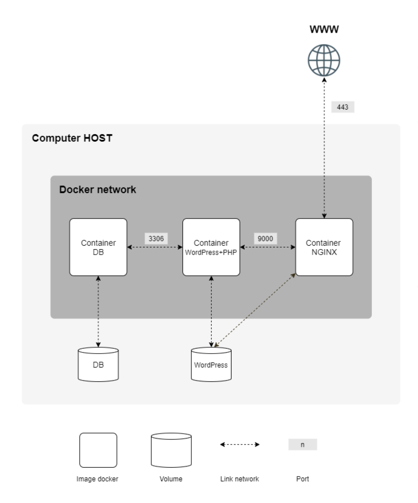

# Inception

This project was a comprehensive exercise in System Administration, particularly focusing on Docker and containerization.

## Project Overview

The primary objective of this project was to set up a small infrastructure composed of different services, each running in a dedicated Docker container. The project was entirely carried out in a container, using docker-compose.

## Skills and Knowledge Gained

This project required a deep understanding of Docker usage and system administration concepts. Key skills and knowledge gained during this project include:

- Creating and managing Docker images and containers
- Writing Dockerfiles for each service
- Understanding and implementing Docker volumes and networks
- Ensuring container stability and managing crash recovery
- Configuring a domain name to point to a local IP address
- Adhering to security best practices, such as not storing passwords in Dockerfiles

## Project Details

The infrastructure set up as part of this project included:

- A Docker container running NGINX with TLSv1.2 or TLSv1.3 only
- A Docker container running WordPress + php-fpm, installed and configured without NGINX
- A Docker container running MariaDB without NGINX
- A Docker volume containing the WordPress database
- A second Docker volume containing WordPress website files
- A docker-network to establish the connection between containers

  

Also, I ensured that the containers would restart in the event of a crash and that two users were set up in the WordPress database, one of whom is the administrator.

This project demonstrated my ability to follow logical steps, showcase a research and development mindset, and gain a deep understanding of Docker usage and system administration concepts.